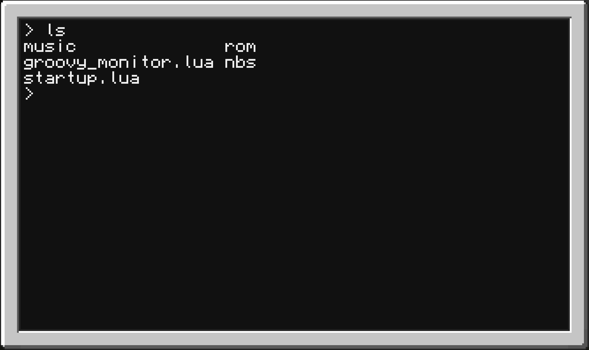
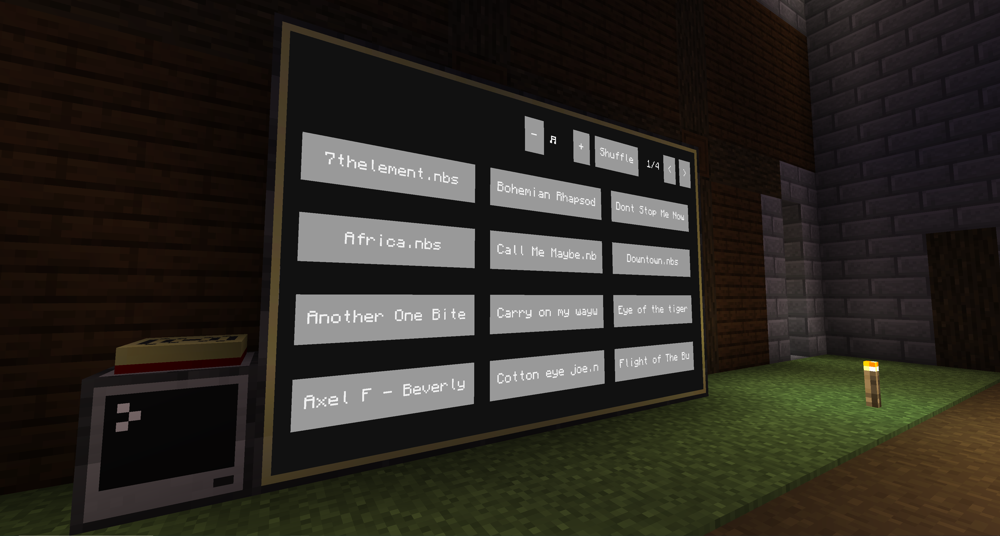
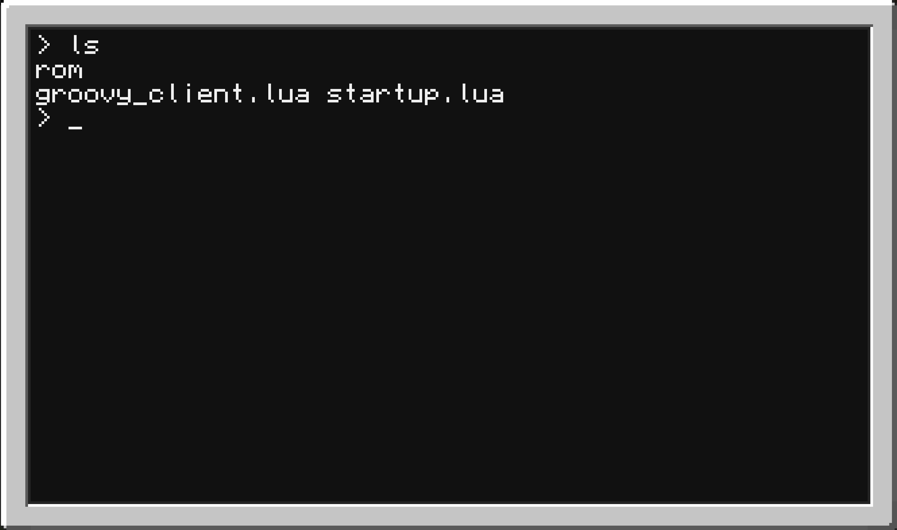
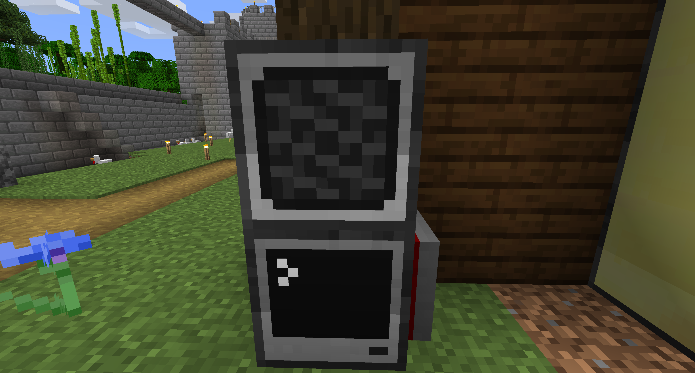

# MC-Groovy

The lua applications groovy-monitor and goovy-client are able to play [Open Note Block Studio](https://hielkeminecraft.github.io/OpenNoteBlockStudio/) songs of the new .nbs format on multiple [ComputerCraft](https://www.computercraft.info/) clients via the rednet api and speakers.

## Groovy-Monitor

Includes a GUI to select .nbs songs of the `music` directory located in the root of a computer. In order to use the monitor application on startup one needs to create a `startup.lua` file in the root directory of the computer. 

```lua
os.run({}, "groovy_monitor.lua", "top", "right")
```

The first parameter `"top"` describes the the side the modem is connected to the monitor-computer.
The second parameter `"right"` describes the side the monitor is connected to the computer.



The computer needs to be connected to a Modem in order to broadcast the song via rednet. It also needs to be connected to advanced monitors to display the GUI of the application. In order to function the lua module `nbs` and `groovy-monitor.lua` need to be placed in the root directory of the computer. 

When a song is selected the monitor reads the corresponding .nbs file of the `music` directory in the root of the computer and broadcasts the song notes and instruments via rednet. The volume of the song can be adjusted while it's playing.



## Groovy-Client

The client computers need to be connected to a speaker (to play the sounds) and a Modem (to receive the songs from the groovy-monitor). In order to use the client application on startup a `startup.lua` needs to be placed in the root directory of the client computers.

```lua
os.run({}, "groovy_client.lua", "right", "top")
```

The first parameter `"right"` describes the the side the modem is connected to the client-computer.
The second parameter `"top"` describes the side the speaker is connected to the client-computer.



When the application is started the computer starts listening to the rednet network for messages with information about the notes to play.

The selected songs are played on all client-computers.



## Downloading Songs

The `downloadFile.lua` provides a simple download of files. Simply use the following command to download some file to your computer.

```bash
> downloadFile {url}, {filePath}
```

The arguments `{url}` and `{filePath}` point to the source location of the file and the destination path on the computer respectively. It can be employed to download .nbs songs from the web.

## References
Also check out the awesome collections of Note Block Studio songs provided by [Ruinscraft](https://github.com/Ruinscraft/powder-resources) and [thatcraniumguy](https://github.com/thatcraniumguy/Songs)!

